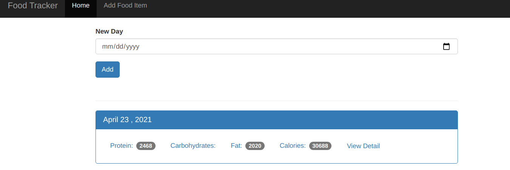
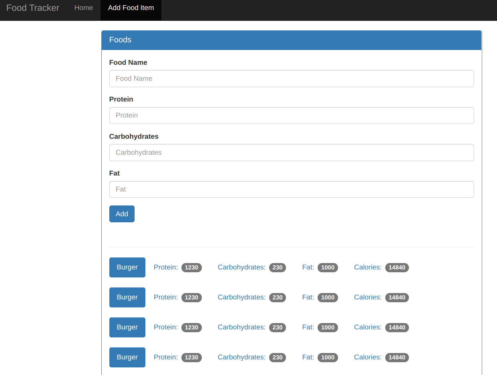
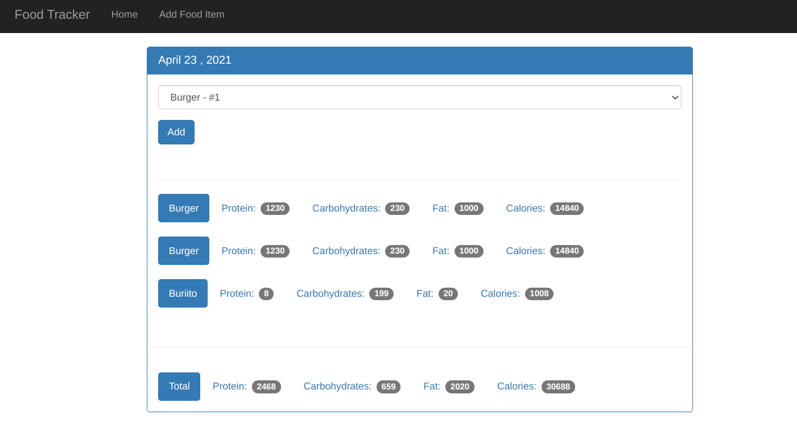

# simple food tracker with flask and sqlite3, frontend with bootstrap
 

## screenshots

Home page


Add food page


Add food page


--- 
# How to run:

## 1- Install dependencies

### 1-1 use ENV
```
source env/bin/activate
```

### 1-2 use pip and install from `requirements.txt`
```
pip install -r requirements.txt
```


## 2- Run the app
### 2-1 setup dataset
```shell
sqlite3  food_log.db < food_tracker.sql
```

### 2-2 set variable and run the app
```shell
export FLASK_APP=app.py
export FLASK_ENV=development
export FLASK_DEBUG=1
flask run
```
### simple way
or just use `setup.sh` to make dataset and run app
```shell
sh  setup.sh
```

**if need just run app use**
```shell
sh  runner.sh
```

## Images form:

https://www.flaticon.com/free-icon/fast-food_2922037

https://www.flaticon.com/free-icon/diet_706164